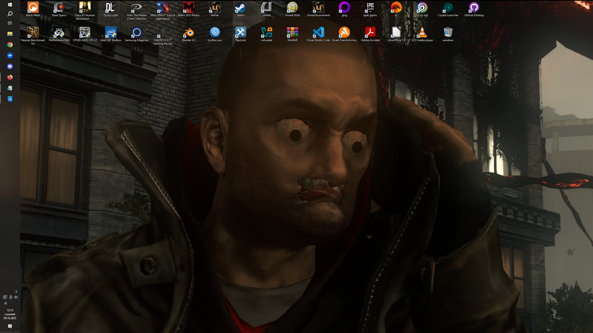

# pogrubienie
## czy powiększenie?
### 2 w 1

*to jest kursywa*

**a to pogrubienie**

~~tak się skreśla tekst~~

> to jest cytat

>> a to też chyba jest cytat

>>> a da się tak?

>>>> im więcej strzałek tym bardziej zagnieżdżony cytat

tak powinna prezentować się pozioma linia:
___

🌶️
