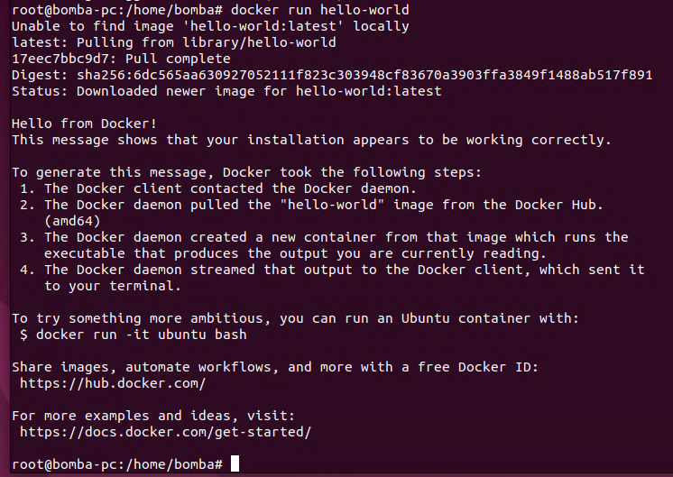
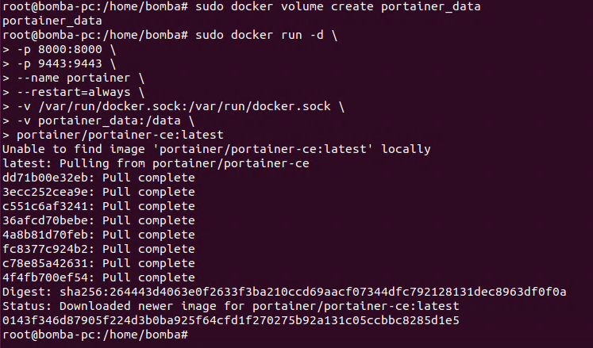

# Docker na WSL (Ubuntu 20.04)
**1. Instalacja:** Wpisz polecenie *sudo apt install docker.io* i Enter, czasem trzeba potwierdzenia (y i Enter), a czasem nie.

**2. Uruchamianie:** Dockera: *sudo dockerd* lub *sudo dockerd $* żeby pracował w tle.

**3. Sprawdzenie:** polecenie *docker run hello-world* pozwala na sprawdzenie czy docker jest poprawnie zainstalowany i działa.

# Docker na Ubuntu 22.04 w trybie graficznym w Hyper-V
**1. Instalacja:** Wpisz polecenie *sudo apt install docker.io* i Enter, czasem trzeba potwierdzenia (y i Enter), a czasem nie.

**2. Uruchamianie:** Dockera: *sudo systemctl enable --now docker*, Docker zostanie uruchomiony.

**3. Sprawdzenie:** polecenie *docker run hello-world* pozwala na sprawdzenie czy docker jest poprawnie zainstalowany i działa.

**4. Instalacja pakietu gaficznego:** pierwsze polecenie jest do utworzenia partycji dla portainera, a druga do uruchomienia go.

**5. Uruchomienie Dockera w trybie graficznym:** w dowolnej przeglądarce w wyszukiwarce URL wpisz "https://localhost:9443" - dotyczy konkretnie ustawionego portu w tym przypadku, port localhost można ustawić prawie dowolny.

## Portainer
Jest to lekka graficzna nakładka (GUI) do zarządzania Dockerem i Docker Swarm.
Działa jako kontener i udostępnia panel przez przeglądarkę, dzięki czemu możesz:
- przeglądać kontenery, obrazy, wolumeny i sieci
- tworzyć i usuwać kontenery jednym kliknięciem
- zarządzać środowiskami lokalnymi i zdalnymi
- monitorować zasoby i logi
- zarządzać kontami i uprawnieniami
