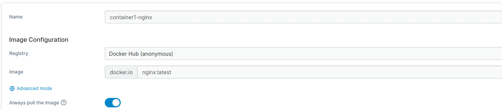

# Docker przez Portainer

### Tworzenie prostego kontenera

1. Menu -> Containers -> Add container.

2. Podaj Name (np. my-nginx), w polu Image wpisz nginx:latest.

3. W Advanced container settings -> Ports -> dodaj mapping, np. Host: 8080 -> Container: 80.

4. Kliknij Deploy the container.
5. Otwarte http://<IP_VM>:8080 pokaże Nginx.

.png)
