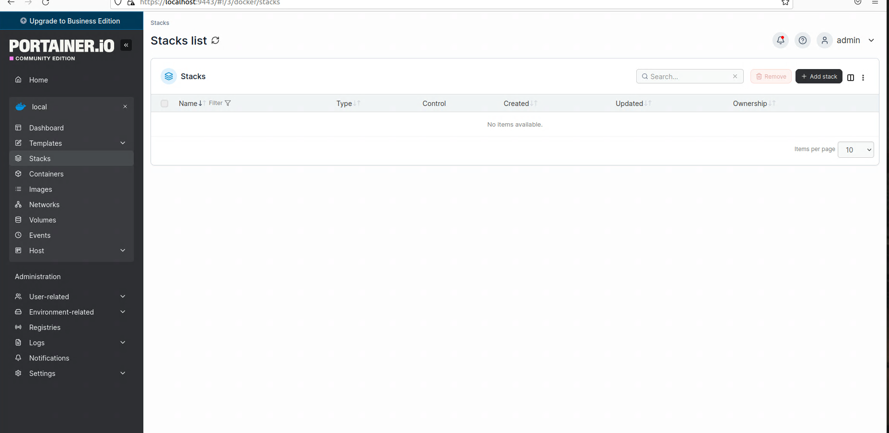

# Docker
Docker to otwartoźródłowa platforma do konteneryzacji, która pozwala pakować aplikacje wraz z ich zależnościami (biblioteki, narzędzia, kod) w izolowane, przenośne jednostki zwane kontenerami. 
Zapewnia to niezależne od środowiska działanie aplikacji, od komputera dewelopera po serwer w chmurze.
Kluczowe dla działania Dockera są obrazy, które są szablonami do tworzenia kontenerów, oraz rejestry do ich przechowywania i udostępniania.
Kontenery działają na wspólnym systemie operacyjnym gospodarza, co sprawia, że są znacznie lżejsze i zużywają mniej zasobów sprzętowych. 
Docker umożliwia:
 - szybkie tworzenie i wdrażanie aplikacji
 - izolację aplikacji, każda działa we własnym kontenerze, co minimalizuje konflikty
 - aplikacja zbudowana raz w kontenerze będzie działać tak samo w każdym środowisku, gdzie zainstalowany jest Docker
 - usprawnia zarządzanie zasobami i upraszcza cykl rozwoju aplikacji.

## Docker Swarm
To wbudowane w Docker narzędzie do orkiestracji kontenerów. Służy do zarządzania klastrem maszyn, które są ze sobą połączone i działają jako jeden wirtualny system. Dzięki temu można łatwo skalować aplikacje, zapewnić im wysoką dostępność i równoważyć obciążenie między wieloma hostami.
Docker Swarm jest łatwiejszy do konfiguracji i użycia niż bardziej złożone systemy, jak Kubernetes. Jest zintegrowany bezpośrednio z interfejsem wiersza poleceń Dockera (CLI).

### Działanie Docker Swarm

- orkiestracja kontenerów: Swarm umożliwia zarządzanie wieloma kontenerami działającymi na wielu hostach, tak jakby stanowiły jeden system.
- Deklaratywny model: Zamiast ręcznego zarządzania kontenerami, definiuje się pożądany stan aplikacji. Swarm dba o to, by ten stan był utrzymany.
- Łatwe skalowanie: Usługi można skalować w górę lub w dół za pomocą prostych poleceń. Swarm automatycznie rozprowadza zadania (kontenery) na dostępne węzły.
- Wysoka dostępność i tolerancja na błędy: Jeśli jeden z węzłów ulegnie awarii, Swarm automatycznie przeniesie jego zadania na inne dostępne węzły, zapewniając ciągłość działania.
- Wbudowane równoważenie obciążenia (load balancer): Wbudowany mechanizm równoważenia obciążenia rozprowadza ruch przychodzący na kontenery należące do danej usługi. 

### Zastosowania Docker Swarm

- dobrze sprawdza się w małych i średnich wdrożeniach, gdzie priorytetem jest prostota i szybkie działanie.
- umożliwia łatwe zarządzanie architekturą mikrousług, gdzie wiele małych, niezależnych usług działa jednocześnie

## Docker przez Portainer

### Tworzenie prostego kontenera

1. Menu -> Containers -> Add container.

2. Podaj Name, w polu Image wpisz nginx:latest - jest to najnowszy oficjalny obraz serwera WWW Nginx.
   Nginx to oprogramowanie serwera WWW o otwartym kodzie źródłowym, które pełni również funkcję odwrotnego proxy, modułu równoważenia obciążenia (load balancer), serwera poczty i serwera strumieniowania multimediów.

3. W Advanced container settings -> Ports -> dodaj mapping, np. Host: 8080 -> Container: 80.

4. Kliknij *Deploy the container*.
5. Otwórz http://<IP_VM>:8080 lub http://localhost:8080 i powinien pokazać się Nginx.

.png)

### Tworzenie kontenera poprzez Stack

1. Menu -> Stacks -> Add stack.

2. Nazwij stack.
**3. Web Editor.** To wbudowany edytor tekstowy w interfejsie Portainera, który służy do wprowadzania (pisania lub wklejania) pliku docker-compose.yml, czyli definicji całej aplikacji (stacka). Pozwala na:
   - napisać lub wkleić kod docker-compose.yml, który opisuje, jakie kontenery mają się uruchomić, z jakich obrazów, na jakich portach, z jakimi zmiennymi środowiskowymi itp.
   - następnie po kliknięciu Deploy the stack, Portainer:
      1. odczytuje ten plik YAML,
      2. uruchamia wszystkie kontenery i sieci zgodnie z definicją,
      3. monitoruje je jako jeden stack (czyli grupę usług).
   - w skrócie Web Editor to miejsce w którym się definiuje aplikacje złożone z jednego lub wielu kontenerów.

4. Na samym dole kliknij Deploy the stack.

## Zarządzanie w portainerze

- Logs: wejdź w konkretny Container -> Logs - sprawdzanie ewentualnych błędów.
- Restart / Stop / Remove: dostępne przy każdym kontenerze.
- Inspect: pokazuje konfigurację, zmienne, mounted volumes.
- Stats: monitorowanie CPU/Memory/Network na żywo.
- Stack -> Recreate: aktualiza stack (np. po zmianie compose / nowy obraz) - można zaznaczyć Pull latest image, wtedy Portainer pobierze najnowszy obraz przed odtworzeniem.

## Kilka komend w wierszu poleceń (konsoli)

- docker ps - pokazuje wszystkie uruchomione kontenery z nazwami, portami i stanem.
- docker images - wyświetla obrazy, obecne lokalnie na serwerze.
- docker logs *nazwa kontenera* - pokazuje dziennik (log) wybranego kontenera, np. błędy lub start aplikacji.
- docker logs -f *nazwa kontenera* - aby śledzić logi na żywo wystarczy dodać -f
- docker exec -it my-nginx /bin/bash - uruchamia konsolę wewnątrz kontenera, dzięki temu można przeglądać jego pliki (ls, cat, cd /usr/share/nginx/html), sprawdzać konfiguracje itp.
- docker stop *nazwa kontenera* - zatrzymywanie kontenera
- docker start *nazwa kontenera* - uruchamianie kontenera
- docker rm *nazwa kontenera* - usuwanie kontenera
- docker system prune -f - czyści nieużywane kontenery, sieci, obrazy, usuwa śmieci
- docker volume ls - lista wolumenów (danych)
- docker stats - na żywo pokazuje CPU/RAM użycie kontenerów.

