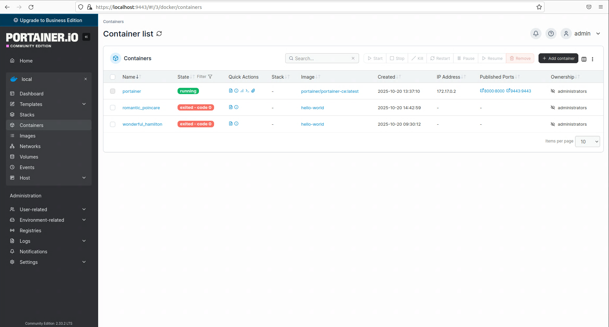

# Docker
Docker to otwartoźródłowa platforma do konteneryzacji, która pozwala pakować aplikacje wraz z ich zależnościami (biblioteki, narzędzia, kod) w izolowane, przenośne jednostki zwane kontenerami. 
Zapewnia to niezależne od środowiska działanie aplikacji, od komputera dewelopera po serwer w chmurze.
Kluczowe dla działania Dockera są obrazy, które są szablonami do tworzenia kontenerów, oraz rejestry do ich przechowywania i udostępniania.
Kontenery działają na wspólnym systemie operacyjnym gospodarza, co sprawia, że są znacznie lżejsze i zużywają mniej zasobów sprzętowych. 
Docker umożliwia:
 - szybkie tworzenie i wdrażanie aplikacji
 - izolację aplikacji, każda działa we własnym kontenerze, co minimalizuje konflikty
 - aplikacja zbudowana raz w kontenerze będzie działać tak samo w każdym środowisku, gdzie zainstalowany jest Docker
 - usprawnia zarządzanie zasobami i upraszcza cykl rozwoju aplikacji.

## Docker przez Portainer

### Tworzenie prostego kontenera

1. Menu -> Containers -> Add container.

2. Podaj Name (np. my-nginx), w polu Image wpisz nginx:latest - jest to najnowszy oficjalny obraz serwera WWW Nginx.

3. W Advanced container settings -> Ports -> dodaj mapping, np. Host: 8080 -> Container: 80.

4. Kliknij *Deploy the container*.
5. Otwórz http://<IP_VM>:8080 lub http://localhost:8080 i powinien pokazać się Nginx.

.png)

## Tworzenie kontenera poprzez Stack

1. Menu -> Stacks -> Add stack.

2. Nazwij stack.
**3. Web Editor.** To wbudowany edytor tekstowy w interfejsie Portainera, który służy do wprowadzania (pisania lub wklejania) pliku docker-compose.yml, czyli definicji całej aplikacji (stacka). Pozwala na:
   - napisać lub wkleić kod docker-compose.yml, który opisuje, jakie kontenery mają się uruchomić, z jakich obrazów, na jakich portach, z jakimi zmiennymi środowiskowymi itp.
   - następnie po kliknięciu Deploy the stack, Portainer:
      1. odczytuje ten plik YAML,
      2. uruchamia wszystkie kontenery i sieci zgodnie z definicją,
      3. monitoruje je jako jeden stack (czyli grupę usług).
   - w skrócie Web Editor to miejsce w którym się definiuje aplikacje złożone z jednego lub wielu kontenerów.

4. Na samym dole kliknij Deploy the stack.
