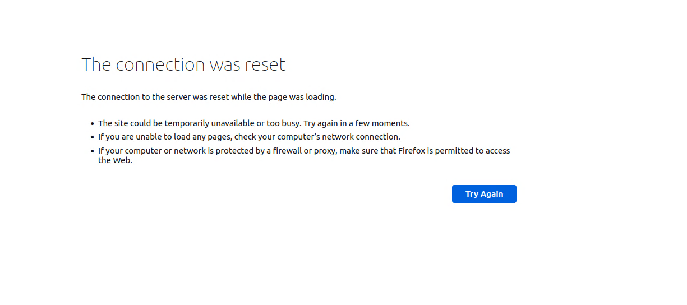
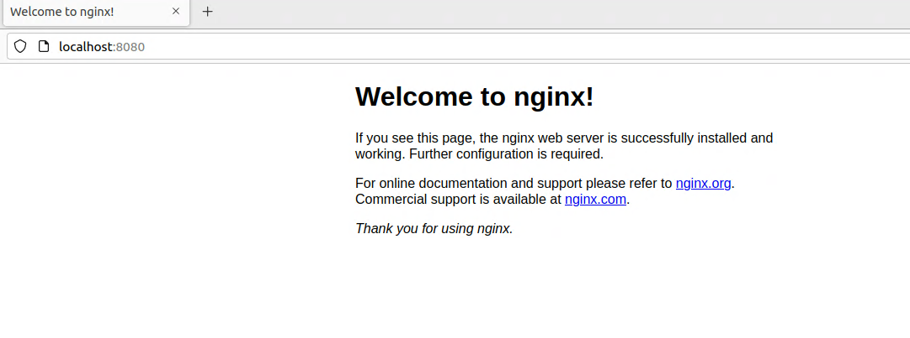
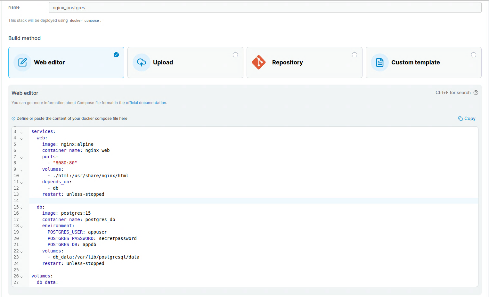
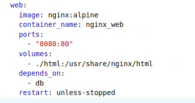
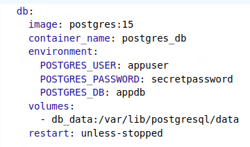

## pierwszy problem

Udało się określić że występuje gdy port jest ustawiony na inny niż 8080:80.

Po ustawieniu takiego portu pojawia się standardowe powitanie Nginx:

## Web Editor.
Web Editor to wbudowany edytor tekstowy w interfejsie Portainera, który służy do wprowadzania (pisania lub wklejania) pliku docker-compose.yml, czyli definicji całej aplikacji (stacka). Pozwala na:
   - napisać lub wkleić kod docker-compose.yml, który opisuje, jakie kontenery mają się uruchomić, z jakich obrazów, na jakich portach, z jakimi zmiennymi środowiskowymi itp.
   - następnie po kliknięciu Deploy the stack, Portainer:
      1. odczytuje ten plik YAML,
      2. uruchamia wszystkie kontenery i sieci zgodnie z definicją,
      3. monitoruje je jako jeden stack (czyli grupę usług).
   - w skrócie Web Editor to miejsce w którym się definiuje aplikacje złożone z jednego lub wielu kontenerów.

## Tworzenie Stack w Web Editor Nginx z Bazą danych
Objaśnienia pod zdjęciem.

Ucięte na samej górze kodu: *version: "3.8"*

**version: "3.8"**

To wersja składni docker-compose. 3.8 to nowoczesna wersja kompatybilna z większością aktualnych Dockerów i Portainerów. Nie wpływa na działanie, ale określa dostępne funkcje (np. depends_on, volumes, networks).

**services:**

Sekcja services definiuje, jakie kontenery będą uruchamiane w ramach aplikacji. Każdy service = jeden kontener (lub replika).

W tym przykładzie są dwa serwisy:
 - web (Nginx) - serwis aplikacyjny (frontend)
 - db (PostgreSQL) - serwis bazy danych PostgreSQL

**web:**

Klucze i ich znaczenia:
 - image: nginx:alpine - pobiera oficjalny obraz Nginx w lekkiej wersji Alpine Linux.
 - container_name - ustalona nazwa kontenera (opcjonalna, ułatwia identyfikację).
 - ports - mapowanie portów: 8080 (host) -> 80 (kontener). Otwórz w przeglądarce: http://localhost:8080.
 - volumes - montuje lokalny katalog ./html (w tym samym folderze co plik compose) do /usr/share/nginx/html w kontenerze. Możesz tam wrzucić pliki index.html.
 - depends_on - docker uruchomi Nginx po starcie bazy (db).
 - restart: unless-stopped - automatyczne ponowne uruchamianie po restarcie systemu lub błędzie (chyba że zatrzymasz ręcznie).

**db:**

Klucze i ich znaczenia
 - image: postgres:15 - oficjalny obraz PostgreSQL w wersji 15.
 - environment - zmienne środowiskowe do konfiguracji bazy (tworzy użytkownika, hasło i bazę przy starcie).
 - volumes - dane bazy będą trwale przechowywane w wolumenie db_data (nie znikną po usunięciu kontenera).
 - restart - jak wyżej (web services) automatyczny restart.

**volumes**

Tworzy named volume (trwałe miejsce na dane). Docker zarządza nim samodzielnie — dane bazy są zachowane między restartami kontenera lub systemu.

