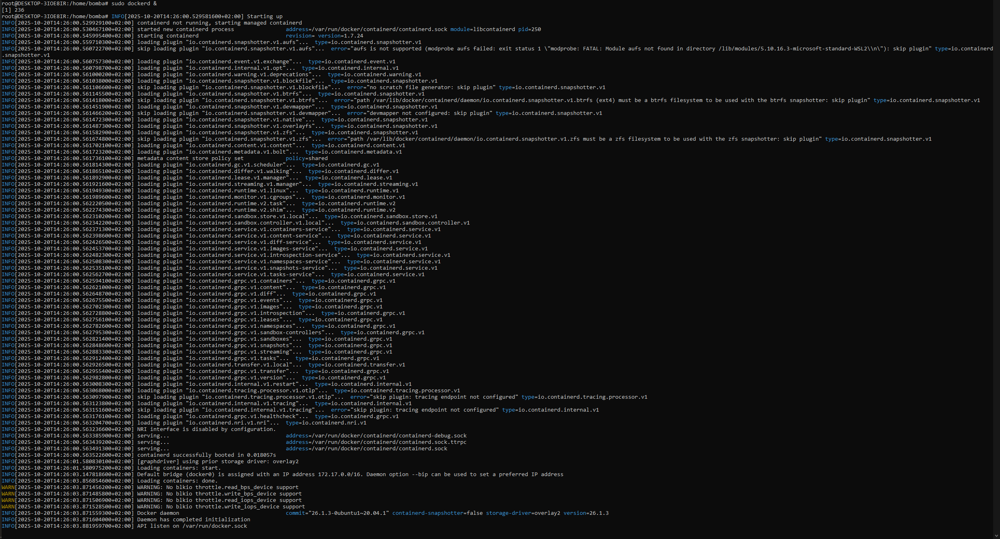
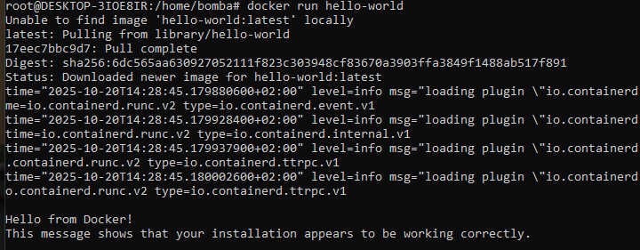
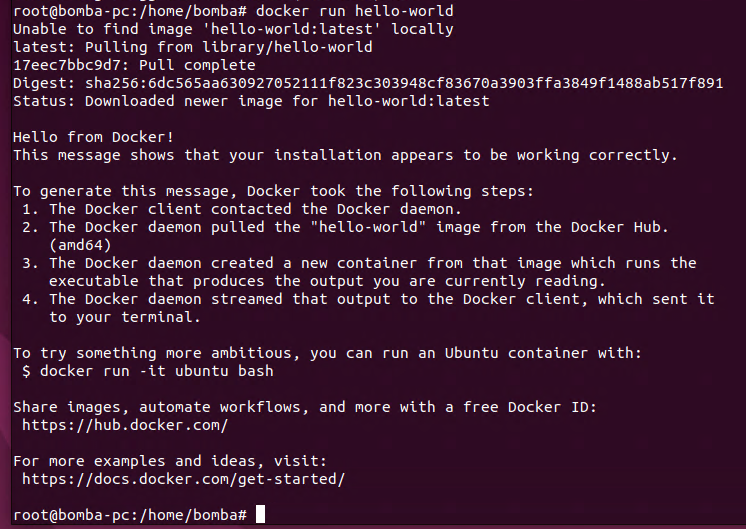
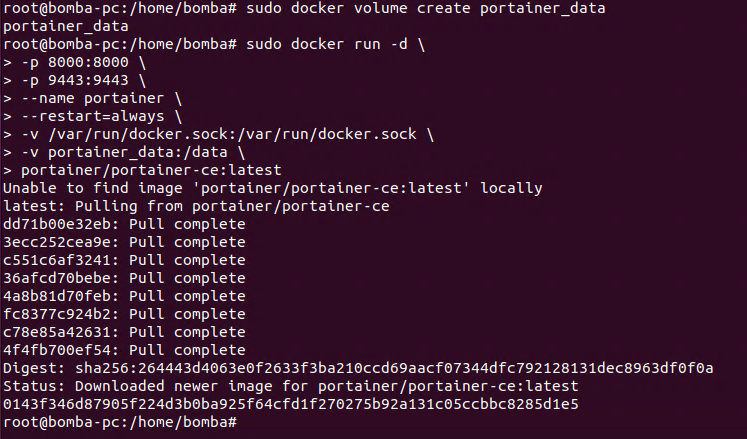
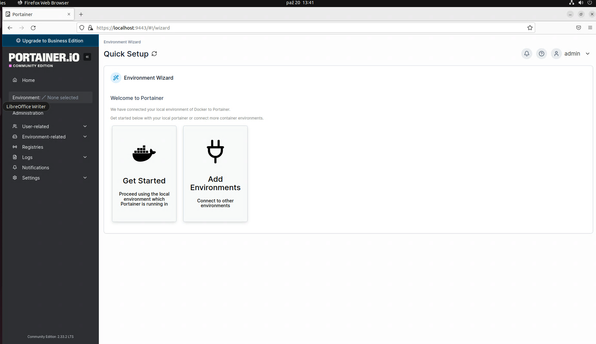
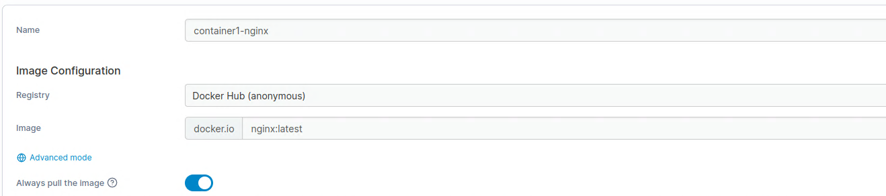
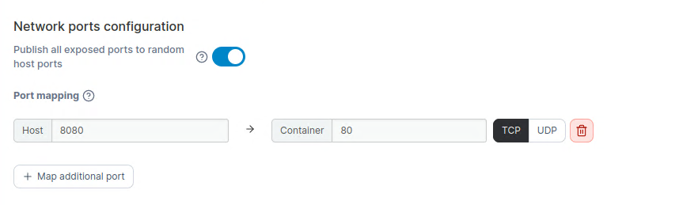
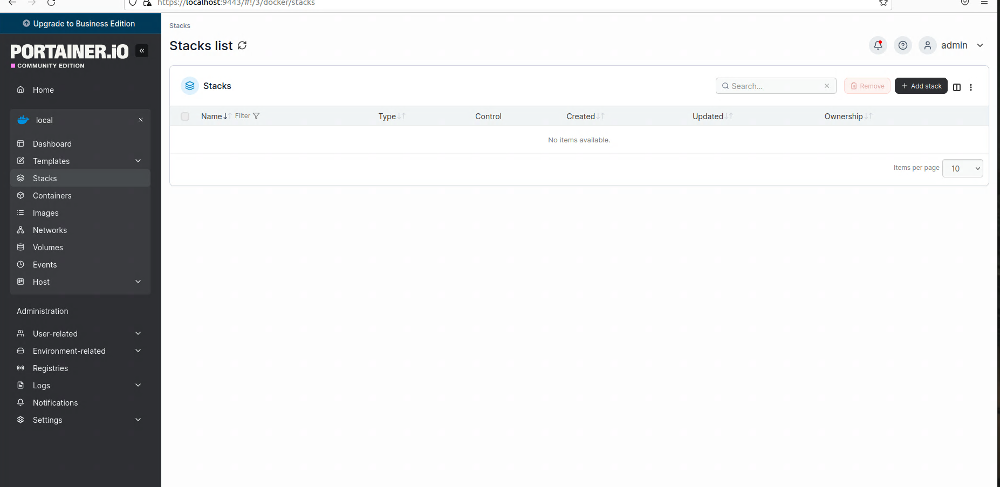
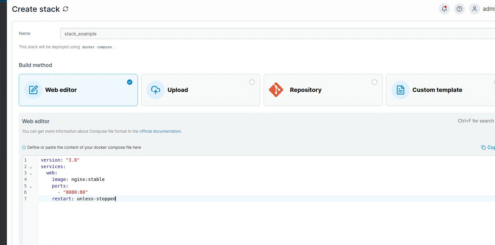

# Hyper-V

### Instalowanie i uruchamianie Hyper-V na Windows 10
Zacząć trzeba od włączenia wirtualizacji procesora w BIOSie lub UEFI na nowszym sprzęcie.

Aby Hyper-V działało na Windowsie potrzebna jest wersja Pro lub Enterprise.

### Uruchamianie Hyper-V
Uruchom PowerShell jako administrator i wpisz poniższe polecenie. Funkcja zostanie uruchomiona i pojawi się zapytanie o restart systemu. Po restarcie Hyper-V będzie zainstalowane i wystarczy uruchomić menedżer funkcji Hyper-V i zacząć pracę z oprogramowaniem.

*Enable-WindowsOptionalFeature -Online -FeatureName Microsoft-Hyper-V -All*

### Tworzenie maszyny wirtualnej
1. Wybierz w polu po lewej stronie komputer na którym ma być utworzona maszyna.
2. Następnie po prawej stronie szybkie tworzenie.
3. Wybierz system jaki chcesz zainstalować, a program zrobi resztę. Zalecam skontrolowanie parametrów jakie dostała maszyna, czy zgadzają się z możliwościami komputera i czy na pewno pozwolą na swobodną pracę wirtualnego systemu.
4. Potem wybierz połącz i uruchom maszynę.
5. Po uruchomieniu będzie potrzebna konfiguracja wstępna i instalacja.
6. System powinien działać poprawnie, z dostępem do internetu.

# Linux

Linux jest rodziną systemów operacyjnych opartych na jądrze Linux. Są one darmowe i otwartoźródłowe. Używane w serwerach, komputerach osobistych i urządzeniach mobilnych (Android).

**Główne distra Linuxa**
1. Debian - stawia na stabilność i bezpieczeństwo, ma wolniejsze ale dokładniejsze aktualizacje, jest popularny w serwerach i jako baza dla innych distr.
2. Arch Linux - rolling release (ciągłe aktualizacje), użytkownik sam składa system (dla doświadczonych osób), dokumentacja (Arch Wiki) jest bardzo rozbudowana.
3. openSUSE - ma dwa warianty: Leap jest stabilny i Tubleweed, który jest na rolling release, do zarządzania systemem używa się narzędzia YaST.
4. Red Hat Enterprise Linux (RHEL) / CentOS / AlmaLinux / Rocky Linux - Przeznaczony dla serwerów, ma zapewniony długi cykl wsparcia.
5. Ubuntu - najbardziej przyjazne dla początkujących, zbudowane na Debianie, ma duże wsparcie społeczności i firm.
6. Mint - oparty na Ubuntu, wygląd pulpitu częściowo podobny do Windowsa poprzez użycie nakładki graficznej (cinnamon), co powoduje że najłatwiej się na niego przesiąść z Windowsa.
7. Fedora - świerze oprogramowanie, wspierane przez Red Hat, dobry dla deweloperów i testowania nowości.

## Ubuntu 22.04 LTS z nakładką graficzną
LTS (Long-Term Support) oznacza długie wsparcie, dla tej wersji jest to do 2027 roku, która fuckcjonuje już od roku 2022.

Jest to system stabilny, nadający się jako system serwerowy lub konsumencki. Może on działać z nakładką graficzną (w tym przypadku GNOME 42), która ma tradycyjny wygląd pulpitu.

Ubuntu 22.04 jest dobrym rozwiązaniem dla osób zaczynających działania z Linuxem, dla osób które chcą mieć stabilny system bez częstych reinstalacji.

### Podstawowe komendy
- sudo su - nadaje użytkownikowi uprawnienia roota, czyli może on po tym zrobic absolutnie wszystko co da się zrobić z systemem
- cd / - przenosi do folderu domowego, cd/*nazwa folderu* przenosi do kolejnego katalogu
- ls, ls -l - pokazuje zawartość katalogu, pokazuje szczegółową zawartość katalogu z uprawnieniami
- pwd - pokazuje bierzący katalog
- mkdir *nazwa* - tworzy katalog o określonej nazwie
- rm - usuwa pliki (rm *nazwa pliku*) lub katalogi wraz z ich zawartością (rm -r *nazwa katalogu*)
- cp - kopiowanie pliku lub katalogu (cp *źródło* *cel*), można też kopiować plik w tym samym katalogu (cp *nazwa pliku* *nowa nazwa pliku*)
- mv - przenoszenie plików lub katalogów (mv *źródło* *cel*), lub zmiana nazwy pliku lub katalogu (mv *nazwa pliku* *nowa nazwa pliku*)
- uname -a - pokazuje informacje o systemie
- df -h - pokazuje miejsce na dyskach w czytelny i przejrzysty sposób
- free -h - pokazuje użycie pamięci RAM
- top - monitor procesów w czasie rzeczywistym
- uptime - pokazuje obciążenie CPU i czas pracy systemu
- sudo apt update - odświeża listę pakietów do aktualizacji
- sudo apt upgrade/full-upgrade - aktualizuje zainstalowane pakiety
- sudo apt install *nazwa pakietu* - instaluje pakiet o określonej nazwie
- sudo apt remove *nazwa pakietu* - odinstalowywuje pakiet o określonej nazwie
- sudo apt autoremove - usuwa starsze wersje pakietu i pliki instalacyjne
- apt list --upgradable - wyświetla wszystkie pakiety które można zaktualizować
- man *komenda* - pokazuje instrukcję użycia danej komendy
- cat *nazwa pliku* - wyświetla zawartość pliku
- nano *nazwa pliku* - otwiera plik w prostym edytorze tekstu
- shutdown now - wyłącza system natychmiast

### Instalacja przykładowej aplikacji (VLC media player)
1. Wpisz komendę *sudo snap install VLC*
2. Poczekaj
3. Wpisz *vlc* i aplikacja się uruchomi.

Jest to prosta metoda instalowania wielu programów, np. VS Code wymaga odświeżenia pakietów, dodania klucza GPG od Microsoftu, dodania repozytorium VS Code, odświerzenia pakietów i wtedy da się instalować (standardowa metoda poporzez *sudo apt install*)

Za to *sudo snap install code --classic* pozwoli na łatwe i bezproblemowe zainstalowanie VS Code.

Na uruchomienie wystarczy tylko wpisać *code* i [będzie działać](./VSC_linux.png)

*sudo snap remove code* - odinstalowywuje VS Code

### Tworzenie i edycja plików tekstowych.
1. Konemdą *cd /* udajemy się do katalodu głównego
2. Tam za pomocą *mkdir projekty* tworzymy katalog "projekty"
3. cd projekty przenosi nas do tego katalogu
4. Komendą *touch notatka.txt* tworzymy [plik tekstowy](przed_edycja.png)
5. *nano notatka.txt* otwiera plik w [edytorze tekstu](./edytor.png), zamyka się crtl+x, a potem trzeba potwierdzić zapisanie lub odrzucenie zmian w pliku

Nano otwiera oprócz plików tekstowych także konfiguracyjne (.conf, .yaml)

# Docker na WSL (Ubuntu 20.04)
**1. Instalacja:** Wpisz polecenie *sudo apt install docker.io* i Enter, czasem trzeba potwierdzenia (y i Enter), a czasem nie.

**2. Uruchamianie:** Dockera: *sudo dockerd* lub *sudo dockerd $* żeby pracował w tle.

**3. Sprawdzenie:** polecenie *docker run hello-world* pozwala na sprawdzenie czy docker jest poprawnie zainstalowany i działa.

# Docker na Ubuntu 22.04 w trybie graficznym w Hyper-V
**1. Instalacja:** Wpisz polecenie *sudo apt install docker.io* i Enter, czasem trzeba potwierdzenia (y i Enter), a czasem nie.

**2. Uruchamianie:** Dockera: *sudo systemctl enable --now docker*, Docker zostanie uruchomiony.

**3. Sprawdzenie:** polecenie *docker run hello-world* pozwala na sprawdzenie czy docker jest poprawnie zainstalowany i działa.

**4. Instalacja pakietu gaficznego:** pierwsze polecenie jest do utworzenia partycji dla portainera, a druga do uruchomienia go.

**5. Uruchomienie Dockera w trybie graficznym:** w dowolnej przeglądarce w wyszukiwarce URL wpisz "https://localhost:9443" - dotyczy konkretnie ustawionego portu w tym przypadku, port localhost można ustawić prawie dowolny.

## Portainer
Jest to lekka graficzna nakładka (GUI) do zarządzania Dockerem i Docker Swarm.
Działa jako kontener i udostępnia panel przez przeglądarkę, dzięki czemu możesz:
- przeglądać kontenery, obrazy, wolumeny i sieci
- tworzyć i usuwać kontenery jednym kliknięciem
- zarządzać środowiskami lokalnymi i zdalnymi
- monitorować zasoby i logi
- zarządzać kontami i uprawnieniami

# Docker
Docker to otwartoźródłowa platforma do konteneryzacji, która pozwala pakować aplikacje wraz z ich zależnościami (biblioteki, narzędzia, kod) w izolowane, przenośne jednostki zwane kontenerami. 
Zapewnia to niezależne od środowiska działanie aplikacji, od komputera dewelopera po serwer w chmurze.
Kluczowe dla działania Dockera są obrazy, które są szablonami do tworzenia kontenerów, oraz rejestry do ich przechowywania i udostępniania.
Kontenery działają na wspólnym systemie operacyjnym gospodarza, co sprawia, że są znacznie lżejsze i zużywają mniej zasobów sprzętowych. 
Docker umożliwia:
 - szybkie tworzenie i wdrażanie aplikacji
 - izolację aplikacji, każda działa we własnym kontenerze, co minimalizuje konflikty
 - aplikacja zbudowana raz w kontenerze będzie działać tak samo w każdym środowisku, gdzie zainstalowany jest Docker
 - usprawnia zarządzanie zasobami i upraszcza cykl rozwoju aplikacji.

## Docker Swarm
To wbudowane w Docker narzędzie do orkiestracji kontenerów. Służy do zarządzania klastrem maszyn, które są ze sobą połączone i działają jako jeden wirtualny system. Dzięki temu można łatwo skalować aplikacje, zapewnić im wysoką dostępność i równoważyć obciążenie między wieloma hostami.
Docker Swarm jest łatwiejszy do konfiguracji i użycia niż bardziej złożone systemy, jak Kubernetes. Jest zintegrowany bezpośrednio z interfejsem wiersza poleceń Dockera (CLI).

### Działanie Docker Swarm

- orkiestracja kontenerów: Swarm umożliwia zarządzanie wieloma kontenerami działającymi na wielu hostach, tak jakby stanowiły jeden system.
- deklaratywny model: zamiast ręcznego zarządzania kontenerami, definiuje się pożądany stan aplikacji. Swarm dba o to, by ten stan był utrzymany.
- łatwe skalowanie: usługi można skalować w górę lub w dół za pomocą prostych poleceń. Swarm automatycznie rozprowadza zadania (kontenery) na dostępne węzły.
- wysoka dostępność i tolerancja na błędy: jeśli jeden z węzłów ulegnie awarii, Swarm automatycznie przeniesie jego zadania na inne dostępne węzły, zapewniając ciągłość działania.
- wbudowane równoważenie obciążenia (load balancer): wbudowany mechanizm równoważenia obciążenia rozprowadza ruch przychodzący na kontenery należące do danej usługi. 

### Zastosowania Docker Swarm

- dobrze sprawdza się w małych i średnich wdrożeniach, gdzie priorytetem jest prostota i szybkie działanie.
- umożliwia łatwe zarządzanie architekturą mikrousług, gdzie wiele małych, niezależnych usług działa jednocześnie

## Docker przez Portainer

### Tworzenie prostego kontenera

1. Menu -> Containers -> Add container.

2. Podaj Name, w polu Image wpisz nginx:latest - jest to najnowszy oficjalny obraz serwera WWW Nginx.
   Nginx to oprogramowanie serwera WWW o otwartym kodzie źródłowym, które pełni również funkcję odwrotnego proxy, modułu równoważenia obciążenia (load balancer), serwera poczty i serwera strumieniowania multimediów.

3. W Advanced container settings -> Ports -> dodaj mapping, np. Host: 8080 -> Container: 80.

4. Kliknij *Deploy the container*.
5. Otwórz http://<IP_VM>:8080 lub http://localhost:8080 i powinien pokazać się Nginx.

.png)

### Tworzenie kontenera poprzez Stack

1. Menu -> Stacks -> Add stack.

2. Nazwij stack.
**3. Web Editor.** To wbudowany edytor tekstowy w interfejsie Portainera, który służy do wprowadzania (pisania lub wklejania) pliku docker-compose.yml, czyli definicji całej aplikacji (stacka). Pozwala na:
   - napisać lub wkleić kod docker-compose.yml, który opisuje, jakie kontenery mają się uruchomić, z jakich obrazów, na jakich portach, z jakimi zmiennymi środowiskowymi itp.
   - następnie po kliknięciu Deploy the stack, Portainer:
      1. odczytuje ten plik YAML,
      2. uruchamia wszystkie kontenery i sieci zgodnie z definicją,
      3. monitoruje je jako jeden stack (czyli grupę usług).
   - w skrócie Web Editor to miejsce w którym się definiuje aplikacje złożone z jednego lub wielu kontenerów.

4. Na samym dole kliknij *Deploy the stack*.

## Zarządzanie w portainerze

- Logs: wejdź w konkretny Container -> Logs - sprawdzanie ewentualnych błędów.
- Restart / Stop / Remove: dostępne przy każdym kontenerze.
- Inspect: pokazuje konfigurację, zmienne, mounted volumes.
- Stats: monitorowanie CPU/Memory/Network na żywo.
- Stack -> Recreate: aktualiza stack (np. po zmianie compose / nowy obraz) - można zaznaczyć Pull latest image, wtedy Portainer pobierze najnowszy obraz przed odtworzeniem.

## Kilka komend w wierszu poleceń (konsoli)

- docker ps - pokazuje wszystkie uruchomione kontenery z nazwami, portami i stanem.
- docker images - wyświetla obrazy, obecne lokalnie na serwerze.
- docker logs *nazwa kontenera* - pokazuje dziennik (log) wybranego kontenera, np. błędy lub start aplikacji.
- docker logs -f *nazwa kontenera* - aby śledzić logi na żywo wystarczy dodać -f
- docker exec -it my-nginx /bin/bash - uruchamia konsolę wewnątrz kontenera, dzięki temu można przeglądać jego pliki (ls, cat, cd /usr/share/nginx/html), sprawdzać konfiguracje itp.
- docker stop *nazwa kontenera* - zatrzymywanie kontenera
- docker start *nazwa kontenera* - uruchamianie kontenera
- docker rm *nazwa kontenera* - usuwanie kontenera
- docker system prune -f - czyści nieużywane kontenery, sieci, obrazy, usuwa śmieci
- docker volume ls - lista wolumenów (danych)
- docker stats - na żywo pokazuje CPU/RAM użycie kontenerów.

